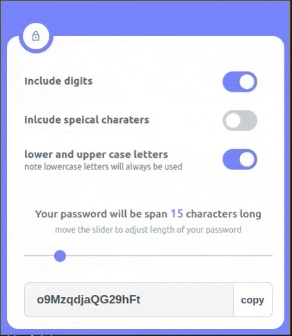

# Random Password Generator Readme

## Overview
This application is a random password generator built using HTML, CSS, and JavaScript.  It allows users to generate secure passwords of variable length and complexity.

## Features
- Adjustable password length using a range input slider.
- Options to include digits, special characters, and mix letter cases.
- Real-time generation of passwords based on user preferences.
- Copy generated password to clipboard with a single click.
- Visual confirmation of password copy operation.

## Usage
1. Open the `index.html` file in a web browser.
2. Adjust the password length using the range input slider.
3. Check/uncheck options to include digits, special characters, and mix letter cases as desired.
4. The generated password will be displayed in the designated input field.
5. Click the "Copy Password" button to copy the generated password to the clipboard.
6. A confirmation message will briefly appear to indicate successful copying.

## Implementation Details
- `index.html`: Contains the structure of the web page, including inputs and buttons.
- `style.css`: Provides styling for the UI elements.
- `script.js`: Implements the logic for generating passwords and handling user interactions.
  
## Adding Code
To add code to the JavaScript file (`script.js`):
1. Define the character sets for digits, special characters, lowercase letters, and uppercase letters.
2. Access DOM elements for password inputs, range inputs, and checkboxes.
3. Implement the `generatePassword` function to create passwords based on user preferences.
4. Attach event listeners to handle changes in password length, checkbox states, and copying passwords.

## Demo



**Using the Browser Extension:**

Follow these steps to use the Random Password Generator as a browser extension:

1. **Clone the Repository:**
   Clone or download the repository to your local machine using Git or by downloading the ZIP file.

```bash
git clone https://github.com/your-username/random-password-generator.git
```

2. **Install Dependencies (if any):**
If the extension requires any dependencies or build steps, follow the instructions provided in the repository's README file.

3. **Load the Extension in Browser:**
- **For Chrome:**
  1. Open Google Chrome and navigate to `chrome://extensions/`.
  2. Enable "Developer mode" by toggling the switch in the top-right corner.
  3. Click on the "Load unpacked" button.
  4. Select the directory where you cloned or downloaded the repository.

- **For Firefox:**
  1. Open Firefox and navigate to `about:debugging#/runtime/this-firefox`.
  2. Click on "Load Temporary Add-on" or "Load Temporary Add-on..." depending on your Firefox version.
  3. Select the `manifest.json` file from the directory where you cloned or downloaded the repository.

- **For Brave or Other Chromium-based Browsers:**
  1. Open Brave or the respective browser and navigate to `chrome://extensions/`.
  2. Enable "Developer mode" by toggling the switch in the top-right corner.
  3. Click on the "Load unpacked" button.
  4. Select the directory where you cloned or downloaded the repository.
